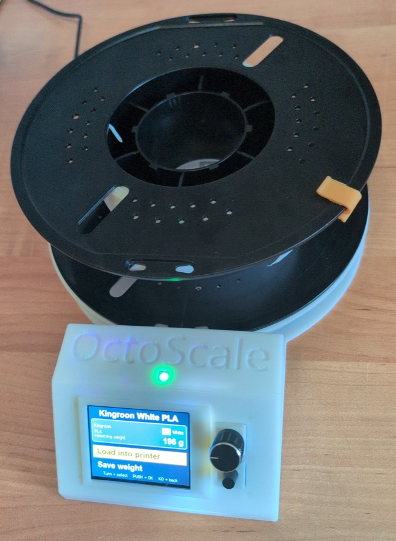

<!-- markdownlint-disable MD033 -->

  

  <b>NFC filament scale for OctoPrint + SpoolManagerExtended.</b> 
  Weigh a spool, tap its tag, and load it into a printer or save its remaining weight.

<!-- markdownlint-enable MD033 -->

[![License][badge-license]](LICENSE)
[![Build][badge-build]](https://github.com/Ajimaru/OctoScale/actions/workflows/build.yml)
[![Platform][badge-platform]](https://www.espressif.com/en/products/socs/esp32-s3)
[![PlatformIO][badge-pio]](https://platformio.org)
[![Latest Release][badge-release]](https://github.com/Ajimaru/OctoScale/releases/latest)
[![Downloads][badge-downloads]](https://github.com/Ajimaru/OctoScale/releases)
[![Made with Love][badge-love]](https://github.com/Ajimaru/OctoScale)

[badge-license]: https://img.shields.io/github/license/Ajimaru/OctoScale?style=flat-square
[badge-build]: https://img.shields.io/github/actions/workflow/status/Ajimaru/OctoScale/build.yml?style=flat-square
[badge-platform]: https://img.shields.io/badge/ESP32--S3-N16R8-blue.svg?style=flat-square
[badge-pio]: https://img.shields.io/badge/PlatformIO-Arduino-orange.svg?style=flat-square
[badge-release]: https://img.shields.io/github/v/release/Ajimaru/OctoScale?style=flat-square
[badge-downloads]: https://img.shields.io/github/downloads/Ajimaru/OctoScale/total.svg?style=flat-square
[badge-love]: https://img.shields.io/badge/made_with-%E2%9D%A4%EF%B8%8F-ff69b4?style=flat-square

> [!WARNING]
> Database features require [OctoPrint-SpoolManagerExtended](https://github.com/Ajimaru/OctoPrint-SpoolManagerExtended).
> Without it, the device still supports weighing, calibration, and NFC tag operations.

<!-- markdownlint-disable MD033 -->

  

<!-- markdownlint-enable MD033 -->

## What it does

OctoScale combines an ESP32-S3, load cell, PN5180 NFC reader, TFT menu, and web UI into one filament-management appliance. It reads spool tags, looks them up in SpoolManagerExtended, loads them into an OctoPrint printer/tool, and writes measured weight back to the database.

It also supports standalone weighing and NFC tag read/write operations, OTA updates, multiple OctoPrint instances, database failover, encrypted configuration backups, and device diagnostics.

## Documentation

The complete build and maintenance documentation is in the Assembly Guide:

- [OctoScale Features](https://github.com/Ajimaru/OctoScale/wiki/Features) — supported scale, NFC, interface, connectivity, OTA, and backup features.
- [Hardware & Printing Guide](https://github.com/Ajimaru/OctoScale/wiki/Hardware-and-Printing-Guide) — hardware BOM and printable enclosure parts.
- [OctoScale Assembly Guide](https://github.com/Ajimaru/OctoScale/wiki/Assembly-Guide) — wiring, enclosure assembly, project layout, and core/task notes.
- [Setup Guide](https://github.com/Ajimaru/OctoScale/wiki/Setup-Guide) — firmware flash, prebuilt `octoscale-usb.bin` and `octoscale-ota.bin` downloads, OTA updates, and first-time setup.
- [Contributing](CONTRIBUTING.md)
- [Security policy](SECURITY.md)
- [Changelog](CHANGELOG.md)
- [License](LICENSE)

The full documentation is maintained in the [GitHub OctoScale Wiki](https://github.com/Ajimaru/OctoScale/wiki).

## License

GNU Lesser General Public License v2.1 or later — see [LICENSE](LICENSE).

Copyright © 2026 Ajimaru
