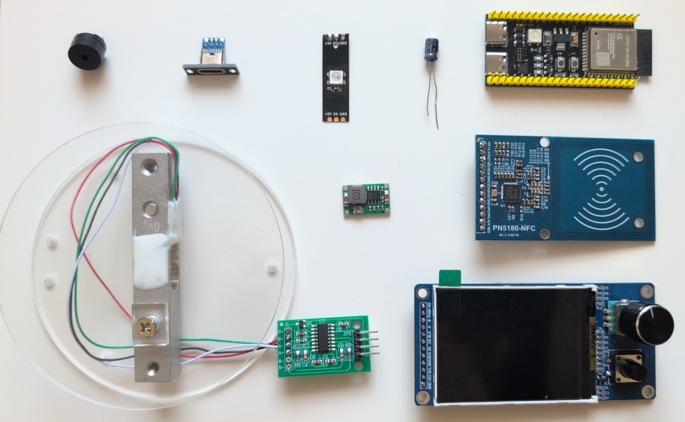
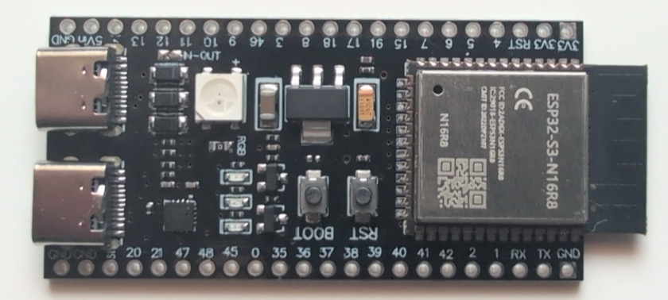
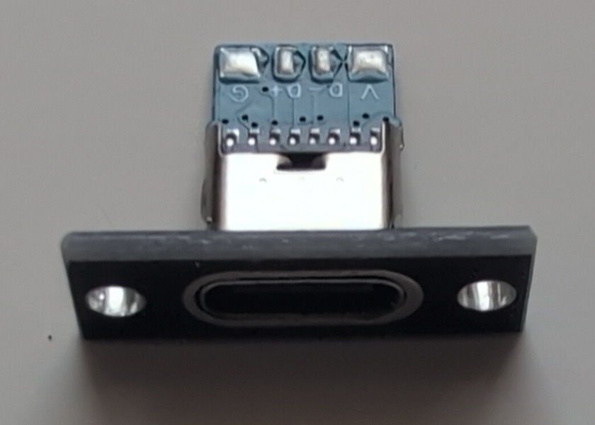
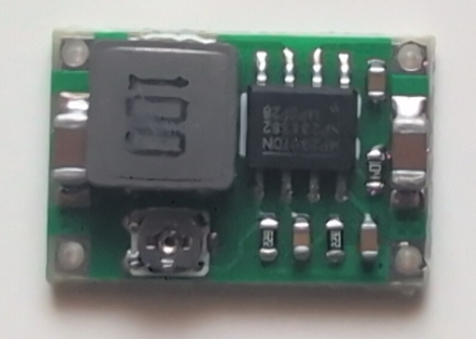
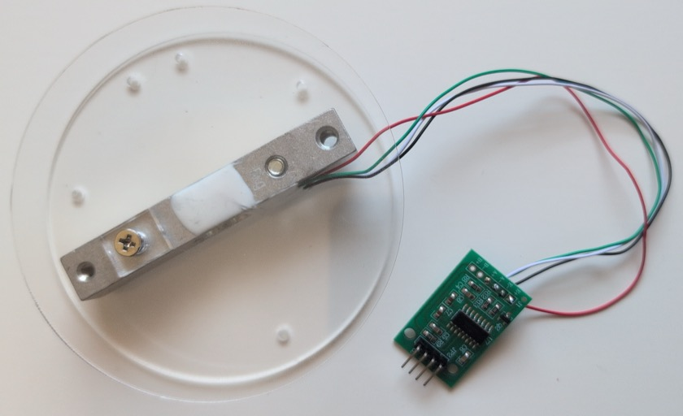
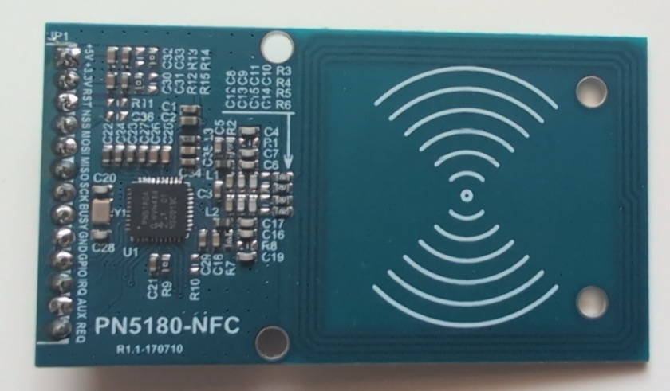
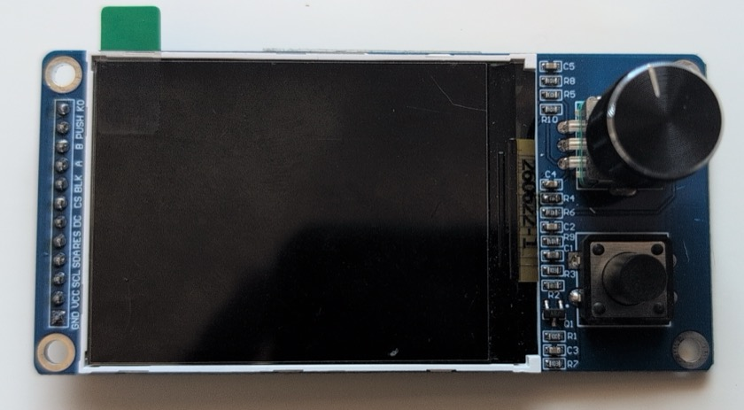
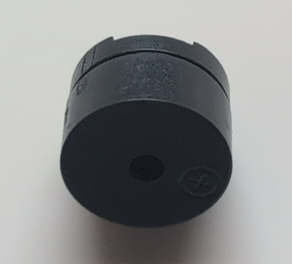
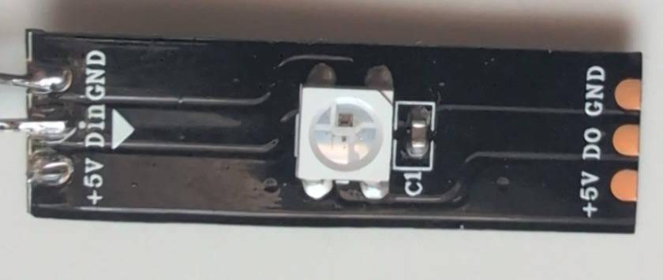

<!-- markdownlint-disable MD033 -->
<p align="center">
  
</p>

<p align="center">
  <b>NFC filament scale for OctoPrint + SpoolManagerExtended.</b><br>
  Put a spool on the scale, tap its tag — the spool loads into your printer or its
  remaining weight goes back into the database. No typing, no guessing.
</p>
<!-- markdownlint-enable MD033 -->

[![License][badge-license]](LICENSE)
[![Build][badge-build]](https://github.com/Ajimaru/OctoScale/actions/workflows/build.yml)
[![Platform][badge-platform]](https://www.espressif.com/en/products/socs/esp32-s3)
[![PlatformIO][badge-pio]](https://platformio.org)
[![Latest Release][badge-release]](https://github.com/Ajimaru/OctoScale/releases/latest)
[![Downloads][badge-downloads]](https://github.com/Ajimaru/OctoScale/releases)
[![Made with Love][badge-love]](https://github.com/Ajimaru/OctoScale)

[badge-license]: https://img.shields.io/github/license/Ajimaru/OctoScale?style=flat-square
[badge-build]: https://img.shields.io/github/actions/workflow/status/Ajimaru/OctoScale/build.yml?style=flat-square
[badge-platform]: https://img.shields.io/badge/ESP32--S3-N16R8-blue.svg?style=flat-square
[badge-pio]: https://img.shields.io/badge/PlatformIO-Arduino-orange.svg?style=flat-square
[badge-release]: https://img.shields.io/github/v/release/Ajimaru/OctoScale?style=flat-square
[badge-downloads]: https://img.shields.io/github/downloads/Ajimaru/OctoScale/total.svg?style=flat-square
[badge-love]: https://img.shields.io/badge/made_with-%E2%9D%A4%EF%B8%8F-ff69b4?style=flat-square

> [!NOTE]
> **About this project.** I built this for my own printer setup with AI, and if it
> helps others, even better. I have tested it to the best of my knowledge and ability
> on real hardware, and every change is built by CI. Issues and PRs are welcome.

---

> ### ⚠️ Requires SpoolManagerExtended
>
> OctoScale is built specifically against
> **[OctoPrint-SpoolManagerExtended](https://github.com/Ajimaru/OctoPrint-SpoolManagerExtended)**
> and depends on API endpoints that the original SpoolManager plugin does not provide.
>
> **Without it, the device still works — but only as a standalone tool:**
> weighing, writing spool numbers to NFC tags, reading tags, and erasing them.
> The whole point of the hardware — tag → database lookup → load into printer, and weight
> written back automatically — needs SpoolManagerExtended on the OctoPrint side.

## What it does

<!-- markdownlint-disable MD033 -->
<p align="center">
  
</p>
<!-- markdownlint-enable MD033 -->

OctoScale is an ESP32-S3 device that combines a **load cell**, an **NFC reader**, a
**TFT menu** and a **web UI** into one appliance for filament management:

1. **Place a tagged spool on the scale.**
2. The PN5180 reads the tag and looks the spool up in **SpoolManagerExtended**.
3. Choose what to do — on the built-in display or in the browser:
   - **Load into printer** → picks printer + tool, tells OctoPrint which spool is now mounted.
   - **Save weight** → weighs the spool live, writes the remaining weight back to the database.

It also *writes* tags: a whole spool record — material, vendor, color, diameter,
weights, temperatures — is encoded onto the tag itself, so the data travels with the
spool even when the database isn't reachable.

## Features

### **Scale**

- HX711 + 5 kg load cell, live readout on display and web UI
- 1-point (quick) or 2-point (linearity-checked) calibration wizard
- Calibration factor persists in NVS across reboots and OTA updates

### **NFC (PN5180)**

- Reads and writes three tag families: **NFC-A/NTAG + Ultralight**, **NFC-V/ISO 15693**,
  and **Mifare Classic 1K**
- Six on-tag payload formats, auto-detected on read:

  | Format | Tag type | Notes |
  | --- | --- | --- |
  | `octoscaleExtended` | Mifare Classic 1K | custom binary layout, CRC-8 commit marker |
  | `ntagExtended` | NTAG | same layout, NTAG page addressing |
  | `nfcvExtended` | NFC-V | same layout, NFC-V blocks |
  | `openSpool` / `nfcvOpenSpool` | NTAG / NFC-V | [OpenSpool](https://openspool.io) NDEF/JSON — readable by third-party apps |
  | `nfcvOpenPrintTag` | NFC-V | [OpenPrintTag](https://specs.openprinttag.org/) CBOR — widest field set, incl. drying data |
  | `tigerTag` | NTAG | [TigerTag](https://tigertag.io) Standard (unsigned) — layout per the [Python SDK](https://github.com/TigerTag-Project/TigerTag-SDK-Python), big-endian 80-byte payload |

- Foreign tags (e.g. a Snapmaker U1 tag) fall back to a **UID lookup** in the
  SpoolManagerExtended database
- Writes report exactly what was lost: `droppedFields` (didn't fit — a bigger tag helps)
  vs. `unsupportedFields` (this format has no such field at all)
- Raw sector/block dump for unknown tags

### **Interface**

- ST7789 320×240 TFT with an EC11 encoder menu that mirrors the entire spool flow
- Boot splash, locked progress screen during OTA, dark/light display theme
- Three idle stages, each with its own timeout: dim → bouncing-logo screensaver →
  panel off (backlight and ST7789 both powered down)
- Hidden test menu on the device (System info screen, hold PUSH 3s): NFC, scale, LED,
  buzzer, screen, button and knob test points for bringing up a freshly built unit
- Web UI in two themes — *OctoScale* and *OctoPrint*, each with dark/light — covering
  weight, calibration, NFC, OctoPrint instances, system, WiFi, and the same test points
- Passive buzzer with event tones, WS2812 status LED (external, mirrored from onboard)
- Opt-in debug console streaming NFC reads/writes and HTTP calls to the browser

### **Connectivity**

- WiFiManager with AP fallback and captive portal
- OTA over `espota`, plus web OTA (upload a `.bin` or let the ESP pull one from a URL)
- Multiple OctoPrint instances; automatic **DB failover** between instances that share
  the same external database
- Config backup/restore as JSON — API keys AES-256-CBC encrypted, never exported in
  plaintext

## Hardware BOM

| Qty | Part | Notes |
| --- | --- | --- |
| 1 | **ESP32-S3-N16R8** dev board (YD-ESP32-S3 / DevKitC-1) | 16 MB flash, 8 MB **octal** PSRAM. The R8/OPI variant is required. |
| 1 | **HX711** ADC breakout | 24-bit load cell amplifier |
| 1 | **5 kg load cell** | straight bar type — buy the kit with the two acrylic mounting plates, the STLs are dimensioned for that combination |
| 1 | **PN5180** NFC module | covers NFC-A *and* NFC-V in one chip — an NFC-A-only reader cannot do OpenPrintTag |
| 1 | **ST7789 TFT 320×240** + **EC11 encoder** + **2 buttons** | the *S11-05* combo module carries all of it on one connector |
| 1 | **Passive buzzer** | driven by LEDC PWM |
| 1 | **470 µF electrolytic capacitor** | **mandatory**, see power notes |
| 1 | **USB-C power supply** | 5 V, ≥ 1.5 A — user-supplied, this is the only power source |
| 1 | **USB-C breakout board** | brings the supply's 5 V onto the build |
| 1 | **Mini-360 buck converter** | makes the 3.3 V rail from 5 V — **output must be set by its trimmer pot before wiring** |
| 1 | **WS2812 RGB LED module** | status LED for the enclosure front — the S3's own onboard LED ends up hidden inside the case |
| 10 | **Self-tapping screws**, ≈ 2.9 mm thread ⌀ (**DIN 7981 ST2.9**), ≈ 9.7 mm overall | hold the boards to the printed parts — they cut their own thread, no heat-set inserts are used. Head shape doesn't matter. |
| 2 | **Self-tapping screws**, ≈ 2.2 mm thread ⌀ (**DIN 7981 ST2.2**), ≈ 6 mm long | mount the USB-C breakout board |

<!-- markdownlint-disable MD033 -->

<!-- markdownlint-enable MD033 -->

### Wiring harness

Dupont jumper wires, sorted by where they run. Two kinds:

- **F–F** — female on both ends, plugs straight onto both headers.
- **F–cut** — female on one end, the other end **cut off, stripped and soldered** to the
  USB-C breakout or the Mini-360, which have solder pads rather than pin headers.
- **plain wire** — no connector at all, soldered on both ends. Only the short hop from
  the breakout to the Mini-360's input.

| Qty | Type | Length | Runs from → to |
| --- | --- | --- | --- |
| 7 | F–F | ~22 cm | PN5180 signals: `SCK` `MOSI` `MISO` `NSS` `BUSY` `RST` `IRQ` → ESP32-S3 |
| 3 | F–cut | ~22 cm | PN5180 power: `#5V` → USB-C breakout, `+3.3V` → Mini-360 `OUT+`, `GND` |
| 2 | F–cut | ~12 cm | ESP32-S3 `5V` + `GND` → USB-C breakout |
| 2 | F–cut | ~12 cm | HX711 `VCC` + `GND` → Mini-360 `OUT+` |
| 2 | F–cut | ~12 cm | TFT `VCC` + `GND` → USB-C breakout |
| 10 | F–F | ~12 cm | TFT module signals: `SCL` `SDA` `RES` `DC` `CS` `BLK` `A` `B` `PUSH` `KO` → ESP32-S3 |
| 2 | F–F | ~12 cm | Buzzer → ESP32-S3 |
| 2 | F–cut | ~12 cm | WS2812 `VCC` → Mini-360 `OUT+`, `GND` |
| 1 | F–cut | ~12 cm | WS2812 `DIN` → ESP32-S3 GPIO 9 (female on the S3 side, soldered at the LED) |
| 2 | plain wire | ~3 cm | USB-C breakout → Mini-360 `IN+` / `IN−` — **soldered at both ends**, no connector (red = 5 V, black = GND) |

The PN5180 gets the long ones because it sits in the scale platform itself, under the
spool — everything else stays near the board.

### Which ESP32-S3 do you actually need?

<!-- markdownlint-disable MD033 -->

<!-- markdownlint-enable MD033 -->

**Reference board: ESP32-S3-N16R8** — 16 MB flash, 8 MB octal (OPI) PSRAM. That is what
`platformio.ini` is configured for out of the box, and what everything here was built
and tested against. Use it and there is nothing to adjust.

If you deviate, this is what actually matters:

| | Requirement | Why |
| --- | --- | --- |
| **Chip** | ESP32-S3 | Not negotiable — dual core, and the pin map assumes S3 |
| **Flash** | **8 MB or more** | The firmware is ~1.6 MB and OTA needs **two** app slots |
| **PSRAM** | **not used at all** | Any variant works, including boards with none |
| **RAM** | built into the chip | ~320 KB internal SRAM, identical on every S3 |

#### Adjusting for a different board

- **8 MB flash (N8R…):** set both `board_upload.flash_size` and
  `board_build.flash_size` to `8MB` in `platformio.ini`.
- **No PSRAM, or quad PSRAM instead of octal (N16R2, N8, …):** remove
  `-DBOARD_HAS_PSRAM` **and** `board_build.arduino.memory_type = qio_opi`. Leaving them
  in is the nastiest failure mode here: the build succeeds and the board then simply
  won't boot, with no compiler error pointing at the cause. As a bonus, GPIOs 26–37 —
  reserved for the octal flash/PSRAM on the reference board — become free.
- **4 MB flash:** not supported as-is. You'd need a custom partition table
  (`min_spiffs.csv` gives ~1.9 MB per app slot) via `board_build.partitions`.

## Wiring

Everything below is wired against an **ESP32-S3-N16R8**. Pin numbers are GPIO numbers as
printed on the board, and match the constants in `src/main.cpp` exactly.

### 1. Power first

<!-- markdownlint-disable MD033 -->
 
<!-- markdownlint-enable MD033 -->

This is the part that decides whether the build works at all, so do it before any signal
wiring.

Power enters through a **USB-C breakout board** and splits into two rails: 5 V straight
from the supply, and 3.3 V from a **Mini-360 buck converter** fed off that same 5 V.
Neither rail comes out of the ESP32-S3.

```diagram
   USB-C PSU (5 V, >= 1.5 A, user-supplied)
        |
   USB-C breakout board
        |
        +-- +5V ---------+---------------- ESP32-S3  +5V   (or VBUS / VIN,
        |                |                                  depends on the board)
        |                |
        |                +---------------- PN5180    +5V   ── 470 µF ──┐
        |                |                                             |
        |                +---------------- TFT       VCC               |
        |                |                                             |
        |                +--- Mini-360 IN+ ─┐                          |
        |                                   |                          |
        |                          Mini-360 OUT+ = #3.3V rail          |
        |                                   |                          |
        |                                   +---- HX711   VCC          |
        |                                   |                          |
        |                                   +---- PN5180  +3.3V        |
        |                                   |                          |
        |                                   +---- WS2812  VCC (ext.)   |
        |                                                              |
       GND ------------- common ground: breakout, Mini-360 GND, -------+
                         ESP32-S3, PN5180, TFT, HX711, WS2812

   /!\  Never plug USB into the S3 while this rail is connected -- see below.
```

> ### ⚠️ Set the Mini-360 BEFORE you connect anything to it
>
> The Mini-360's output is set by the **trimmer potentiometer on the module** and ships
> at an arbitrary voltage — often well above 3.3 V. Feed it 5 V with nothing else
> attached, measure `OUT+` against `GND` with a multimeter, and turn the pot until it
> reads **3.3 V**. Only then wire up the HX711, the PN5180's logic side and the LED.
> Connecting them first can put 5 V or more onto 3.3 V-only parts and destroy them.

- **Both rails come from the external supply, never from the S3.** The S3 is *powered by*
  the 5 V rail (into its `5V` pin), it does not feed anything. Its own `3V3` pin stays
  unconnected — the onboard regulator collapses under the PN5180's RF bursts, which is
  exactly the failure this layout avoids. On boards that don't label that pin `5V`, look
  for **`VBUS`** or **`VIN`** — same net, different silkscreen.
- **The 3.3 V rail is the Mini-360's output**, carrying the HX711, the PN5180's logic
  side and the external WS2812.
- **One common ground for everything.** Breakout, Mini-360, ESP32-S3, PN5180, TFT, HX711
  and the LED all share it. Without a common reference no SPI signal is valid and nothing
  communicates.
- **Put the 470 µF capacitor directly across the PN5180's `#5V` and `GND`**, physically
  at the module, not near the supply.

> ### ⚠️ Never power the board from USB and the 5 V rail at the same time
>
> Plugging a USB cable into the S3 while external 5 V sits on its `5V` pin ties two
> supplies together on one net. Some boards have a protection diode for this, many do
> not — and on those the two sources fight, which can damage the board, the PSU, or the
> USB port of whatever it's plugged into.
>
> So for the **first USB flash, disconnect the external supply**. Afterwards flashing is
> over the air anyway (see [Build & flash](#build--flash)), so the situation doesn't come
> up again in normal use. If you do need USB later — serial monitor, recovery flash —
> unplug the external supply first.

### 2. Load cell → HX711

<!-- markdownlint-disable MD033 -->

<!-- markdownlint-enable MD033 -->

The load cell's four wires go to the HX711's input side. Colours are the common
convention; verify against your cell's datasheet.

| Load cell wire | HX711 pad |
| --- | --- |
| red | `E+` |
| black | `E-` |
| white | `A-` |
| green | `A+` |

If weight readings run backwards (negative when loaded), swap **white** and **green**.
The `B` channel stays unused.

### 3. HX711 → ESP32-S3

| HX711 | GPIO |
| --- | --- |
| `VCC` | 3.3 V rail (Mini-360 `OUT+`) |
| `GND` | `GND` |
| `DT` / `DOUT` | **5** |
| `SCK` | **6** |

### 4. PN5180 NFC reader → ESP32-S3

<!-- markdownlint-disable MD033 -->

<!-- markdownlint-enable MD033 -->

The PN5180 sits on its **own SPI bus (FSPI)** and must not share pins with the display.
The module is labelled `#5V +3.3V RST NSS MOSI MISO SCK BUSY GND GPIO IRQ AUX REQ`.

| PN5180 | GPIO | Role |
| --- | --- | --- |
| `+5V` | 5 V rail (USB-C breakout) | RF power (+ 470 µF here) |
| `+3.3V` | 3.3 V rail (Mini-360 `OUT+`) | logic supply |
| `GND` | `GND` | |
| `SCK` | **12** | SPI clock |
| `MOSI` | **11** | SPI data out |
| `MISO` | **13** | SPI data in |
| `NSS` | **10** | chip select, active low |
| `BUSY` | **14** | status input |
| `RST` | **21** | reset, active low |
| `IRQ` | **47** | interrupt |

`GPIO`, `AUX` and `REQ` stay **unconnected**.

### 5. Display + encoder + buttons → ESP32-S3

<!-- markdownlint-disable MD033 -->

<!-- markdownlint-enable MD033 -->

The *S11-05* combo module carries the ST7789 display, the EC11 encoder and both buttons
on a single connector: `GND VCC SCL SDA RES DC CS BLK A B PUSH KO`. The display runs on
its **own SPI bus (HSPI)**, separate from the PN5180.

| Module pin | GPIO | Role |
| --- | --- | --- |
| `VCC` | 5 V rail (USB-C breakout) | |
| `GND` | `GND` | |
| `SCL` | **42** | display SPI clock |
| `SDA` | **44** | display SPI data (write-only, no MISO) — labelled **`RX`** on most boards, see note |
| `CS` | **38** | display chip select |
| `DC` | **39** | data/command |
| `RES` | **40** | display reset |
| `BLK` | **41** | backlight, PWM-dimmed |
| `A` | **15** | encoder rotation |
| `B` | **16** | encoder rotation |
| `PUSH` | **17** | encoder click |
| `KO` | **18** | start button |

> **GPIO 44 is usually silkscreened `RX`, not `44`.** It's the S3's `U0RXD`, so most dev
> boards print the UART name instead of the GPIO number — on the YD-ESP32-S3 / DevKitC-1
> it sits next to `TX` (GPIO 43) near the USB connector. Same pin either way. Using it
> for the display is fine: the serial console only ever *sends* from `TX`, so taking the
> RX line costs nothing here.

Encoder and buttons use the S3's **internal pull-ups** — their common pin goes to `GND`,
no external resistors needed. If rotation counts the wrong way, swap `A` and `B`.

Using discrete parts instead of the combo module works the same way: display pins to the
ST7789 breakout, `A`/`B`/`PUSH` to the EC11's three pins on one side, `KO` to a push
button, and every switch's other leg to `GND`.

### 6. Buzzer

<!-- markdownlint-disable MD033 -->

<!-- markdownlint-enable MD033 -->

| Buzzer | GPIO |
| --- | --- |
| `+` | **7** |
| `−` | `GND` |

A **passive** buzzer is expected — the firmware generates tones via LEDC PWM. An active
buzzer works but plays only its own fixed pitch.

> GPIO 2 is already taken by the status LED, which is why the buzzer sits on GPIO 7.

### 7. RGB status LED

<!-- markdownlint-disable MD033 -->

<!-- markdownlint-enable MD033 -->

The S3 carries a WS2812 on **GPIO 48**, but once the board is in the enclosure that LED
is invisible. The status readout therefore lives on a **second, external WS2812 on
GPIO 9**, mounted on the enclosure front. The firmware drives both in lockstep — same
color, same instant — so the external one is the LED you actually read.

| WS2812 module | GPIO |
| --- | --- |
| `DIN` | 9 |
| `VCC` | 3.3 V rail (Mini-360 `OUT+`) |
| `GND` | `GND` |

> Use a resistor matching the WS2812's requirements in series with the `DIN` line if not
> present on the module.
>
> **Run the LED off 3.3 V, not 5 V.** A WS2812 wants ~0.7 × VDD on `DIN`, so at 5 V it
> expects 3.5 V while the S3 only drives 3.3 V — under spec, with negative margin. It
> does work in practice (verified on hardware), but it's the kind of margin that holds
> until a longer wire, a warmer enclosure or a different LED batch makes it flicker. On
> the 3.3 V rail the level is exact; the LED is marginally dimmer, and its ~20 mA are
> nothing next to the Mini-360's headroom.

### Complete pin summary

| GPIO | Connected to |
| --- | --- |
| 5 / 6 | HX711 `DT` / `SCK` |
| 7 | Buzzer `+` |
| 9 | WS2812 `DIN` (external, enclosure front) |
| 10 | PN5180 `NSS` |
| 11 / 12 / 13 | PN5180 `MOSI` / `SCK` / `MISO` (FSPI) |
| 14 | PN5180 `BUSY` |
| 15 / 16 / 17 | Encoder `A` / `B` / `PUSH` |
| 18 | Start button `KO` |
| 21 | PN5180 `RST` |
| 38 / 39 / 40 / 41 | TFT `CS` / `DC` / `RES` / `BLK` |
| 42 / 44 | TFT `SCL` / `SDA` (HSPI) — 44 is silkscreened `RX` on most boards |
| 47 | PN5180 `IRQ` |
| 48 | WS2812 (onboard) |

**Off-limits on the S3** — do not repurpose these: strapping pins 0/3/45/46, USB 19/20,
and 26–37 (reserved for the OPI flash and PSRAM).

**Still free:** 8 and 43. GPIO 43 is `U0TXD` — the CH343 USB-serial console — so taking
it costs you the serial monitor; 8 is the last comfortable one.

## Enclosure

Printable parts live in `stl_files/`:

| File | Qty | Part | Print settings |
| --- | --- | --- | --- |
| `OcroScale_Top.stl` | 1 | top plate — the spool rests on this, the PN5180 sits underneath | 0.2 mm layers, 0.25 mm first layer, 15 % infill |
| `OctoScaleBottom.stl` | 1 | base — holds the load cell, the ESP32-S3 and the power side | same |
| `OctoScaleLit.stl` | 1 | front lid — carries the display and the status LED | same |
| `OctoScaleScreenBazel.stl` | 1 | bezel around the display cut-out (64 × 47 × 1.6 mm) | same |
| `OctoScaleKnobCover.stl` | 1 | cap for the EC11 encoder shaft (13.5 mm ⌀, 5.2 mm tall) | same |
| `OctoScaleButtonCover.stl` | 1 | button cap (13.5 mm ⌀, 1.8 mm tall) | same |
| `OctoScaleSpacer.stl` | 10 | washer-style spacer (5.5 × 5.5 × 3.5 mm) under every screw | same |
| `OctoScaleLEDCover.stl` | 1 | light window over the status LED opening (7 × 7 × 1.4 mm) | **transparent filament**, 0.2 mm layers, 0.25 mm first layer, **99.99 % infill** |

**Spacers:** the printed parts are too thin for the screws to bite on their own, so a
spacer goes on top of each mounting point before its screw. Order per point: printed
part (e.g. `OctoScaleBottom.stl`) → the board (e.g. the HX711 PCB) → spacer → screw.

**Mounting is mostly self-explanatory:** each component's name is embossed on the
printed parts, so every module goes where its label says.

The one exception is the **WS2812 status LED**, which has no seat of its own — it is
**glued to the inside of `OctoScaleLit.stl` with superglue**, behind its opening in the
front. Its position is obvious once the lid is in hand. Glue it *after* soldering its
three wires, and check the LED lights before the lid goes on: once it's glued, it does
not come off.

`OctoScaleLEDCover.stl` closes that opening from the outside and diffuses the LED, so
print it in **transparent filament** — in any opaque colour it defeats its own purpose.
The near-solid infill (99.99 %) is what makes it come out clear instead of cloudy: sparse
infill leaves internal air gaps that scatter the light.

## Build & flash

Requires [PlatformIO](https://platformio.org/). Nothing else to fetch by hand — the
patched PN5180 library ships in `lib/`, everything else is pulled from `lib_deps` on the
first build. That first build also downloads the ESP32 toolchain, so expect it to take a
while.

**1. First flash — over USB.** The board must be plugged in; OTA is not an option yet,
the device has no WiFi credentials at this point. **Disconnect the external 5 V supply
while USB is attached** — see the power warning above.

```bash
pio run -e esp32s3 -t upload
```

**2. Join it to your WiFi.** On first boot the device opens an access point named
**`OctoScale-Setup`**. Connect to it, enter your WiFi credentials, and the device
reboots into your network. Note the IP it gets — from your router's client list, or from
the serial monitor (`pio device monitor -e esp32s3`), which prints it on boot. The web UI
then lives at `http://<device-ip>/`.

**3. Every flash after that — over the air.** No USB needed; the device can sit on
external power wherever it's installed.

```bash
pio run -e esp32s3_ota -t upload --upload-port <device-ip>
```

Use the **IP address**, not `octoscale.local` — mDNS resolution adds enough latency to
make espota time out.

## First-time setup

Everything below happens in the web UI at `http://<device-ip>/`. Work through it in
order — the scale has to be calibrated before any weight it reports means anything, and
the database source can only be picked once a printer is known.

### 1. Calibrate the scale (Scale tab)

Out of the box the scale reports a meaningless number: the HX711 delivers raw ADC
counts, and how many counts a gram is depends on the individual load cell. Calibration
is what turns counts into grams, and it is stored in NVS — it survives reboots and
firmware updates, so this is a one-time job per device.

**Have a reference weight ready** whose true weight you know. It does not need to be a
calibration weight: a full water bottle on a kitchen scale, or a spool you have just
weighed, is fine. Accuracy of the reference is what limits accuracy of the device.

1. **Tare with the scale empty.** Remove everything from the top plate first — the
   tare defines "zero", so anything left on it is silently subtracted from every future
   reading.
2. **Pick a method:**
   - **1-point** — place the reference weight, enter its actual weight in grams, hit
     *Calibrate*. Quick and enough for most setups.
   - **2-point** — measures a light and a heavy reference in turn (e.g. an empty and a
     full spool), then computes the slope from both. Corrects better across the whole
     range, which matters if you weigh both nearly-empty and full spools.
3. **Check it.** Put a known weight back on and compare. Repeat the tare if the empty
   scale does not read close to zero.

The **HX711 diagnostics** panel beside it is the place to look if something seems off:
it shows whether the chip responds at all, the raw ADC value, and a noise figure. A
noise value that will not settle usually means a wiring or supply problem rather than a
calibration one.

### 2. Add your printers (Setup tab)

For each OctoPrint instance, enter a name, its IP or hostname, the port, and an **API
key** from OctoPrint's *Settings → API*. Multiple instances are supported — that is how
loading a spool can ask which printer it goes to.

### 3. Choose the spool database (Setup tab)

Pick which OctoPrint instance OctoScale reads spool records from. If several instances
share one **external** database, OctoScale fails over to another instance when the
chosen one is unreachable; a local SQLite database has no such fallback, since each
instance then holds its own separate data.

Use *Test: look up spool ID* to confirm the connection: enter a spool ID that exists in
SpoolManagerExtended and check that the record comes back.

### 4. Optional adjustments

Everything here has a sane default and can be left alone:

| Setting | Where | What it does |
| --- | --- | --- |
| Selection timeout | Setup | How long the load/save prompt waits before it gives up |
| Display | System | Brightness, and the three idle stages (dim → screensaver → off) |
| Status LED | System | Overall brightness; onboard LED on or off |
| Buzzer | System | Event tones, and active vs. passive buzzer |
| Theme | System / display menu | Light or dark, separately for the web UI and the display |

### 5. Try it

Put a tagged spool on the scale. The tag is read, looked up, and the load prompt appears
on the display and in the web UI's Operate tab. A spool whose tag is not yet written can
be given one from the **NFC tab** — *Write ID to tag* puts a spool number on it, and the
full record can be written from the load flow afterwards.

If a tag is not recognised at all, the **Debug tab** has a console that logs every read
and lookup once switched on.

## Software requirements

- **OctoPrint** with **[OctoPrint-SpoolManagerExtended](https://github.com/Ajimaru/OctoPrint-SpoolManagerExtended)**

This is a hard dependency for everything database-related, not a nice-to-have. OctoScale
talks to these endpoints, most of which exist only in the Extended plugin:

| Endpoint | Used for |
| --- | --- |
| `GET /plugin/SpoolManagerExtended/spool/<id>` | look a spool up by the id stored on the tag |
| `GET /plugin/SpoolManagerExtended/spool/byCode/<uid>` | look a foreign tag up by its UID |
| `PUT /plugin/SpoolManagerExtended/spool/<id>/measuredWeight` | write the weighed value back |
| `GET /plugin/SpoolManagerExtended/selectSpoolByQRCode/<id>?tool=<n>` | load a spool into a printer/tool |
| `GET /plugin/SpoolManagerExtended/databaseInfo` | identify the database behind an instance (used for failover) |

All calls are API-key protected. Database access goes exclusively through this HTTP
bridge — OctoScale never talks to MySQL directly.

### Running without SpoolManagerExtended

The firmware does not refuse to start, and these parts remain fully usable on their own:

- weighing, taring and calibrating the scale
- writing a spool number onto an NFC tag (`/nfcwriteid`)
- writing a complete spool record onto a tag, if you supply the values yourself
  (`POST /nfcwritespool`)
- reading and inspecting tags, including raw dumps of unknown ones
- erasing tags

What stops working is the entire automatic flow: no lookup, no printer/tool selection,
no weight written back — the scale becomes a scale with an NFC reader attached.

## Project layout

| Path | Contents |
| --- | --- |
| `src/main.cpp` | WiFi/OTA, HX711, PN5180 task, flow state machine, HTTP endpoints |
| `src/pn5180nfc.h` | NFC read/write for all tag types and payload formats |
| `src/openprinttag.h`, `src/cbor.h` | OpenPrintTag support + a minimal CBOR codec |
| `src/menu.h`, `src/display.h`, `src/encoder.h` | TFT menu, ST7789 driver, EC11 input |
| `src/web_ui.h` | Web UI as a PROGMEM HTML string |
| `src/octoprint.h`, `src/spooldb.h` | OctoPrint instances, SpoolManagerExtended lookups, DB failover |
| `src/backup.h` | Encrypted config backup/restore |
| `src/buzzer.h` | Event tones, active/passive buzzer modes |
| `src/dbglog.h` | In-RAM ring buffer behind the web UI's debug console |
| `src/OctoFontMid.h`, `src/OctoFontBig.h` | Generated VLW fonts (see `tools/make_vlw.py`) |
| `src/OctoLogo.h` | Logo bitmap as RGB565, converted from `assets/octoscale_logo.png` |
| `src/version.h` | `FW_VERSION` — bump on release |
| `tools/make_vlw.py` | Regenerates the VLW font headers |
| `lib/PN5180 Library/` | Vendored + patched PN5180 driver (see `lib/README-patch.md`) |

**Core split:** the HX711 and PN5180 tasks are pinned to **core 0**, WiFi/HTTP/OTA run on
**core 1**. The PN5180 library contains unbounded wait loops, so a reader hang must never
be able to freeze the web server.

## Contributing

Bug reports and pull requests are welcome — see [CONTRIBUTING.md](CONTRIBUTING.md) for
how to build, what the core split means for new code, and what to include in a report.
Security issues: [SECURITY.md](SECURITY.md). Changes per release:
[CHANGELOG.md](CHANGELOG.md).

## License

**GNU Lesser General Public License v2.1 or later** — see [LICENSE](LICENSE).

Copyright © 2026 Ajimaru

This choice is dictated by the dependencies rather than freely picked. OctoScale
**vendors and modifies** the PN5180 library (`lib/PN5180 Library/`, LGPL-2.1) — a BUSY-pin
timeout fix and a new `mifareAuthenticate()` implementation, documented in
[`lib/README-patch.md`](lib/README-patch.md). Distributing a modified LGPL work keeps it
under LGPL, so the project as a whole adopts the same license instead of layering a
different one on top.

| Component | License | Usage |
| --- | --- | --- |
| PN5180 Library — © 2018 Andreas Trappmann | LGPL-2.1 | vendored **and modified** |
| Adafruit NeoPixel | LGPL-3.0 | linked |
| WiFiManager, HX711, ArduinoJson, TFT_eSPI | MIT | linked |

The tag formats OctoScale implements are open specifications, independently implemented
from their published documentation — no code was copied from
[OpenSpool](https://openspool.io),
[OpenPrintTag](https://github.com/OpenPrintTag/openprinttag-specification) or the
[TigerTag Python SDK](https://github.com/TigerTag-Project/TigerTag-SDK-Python) (Apache-2.0),
whose `tigertag/tag.py` served as the byte-layout reference for the `tigerTag` format.
